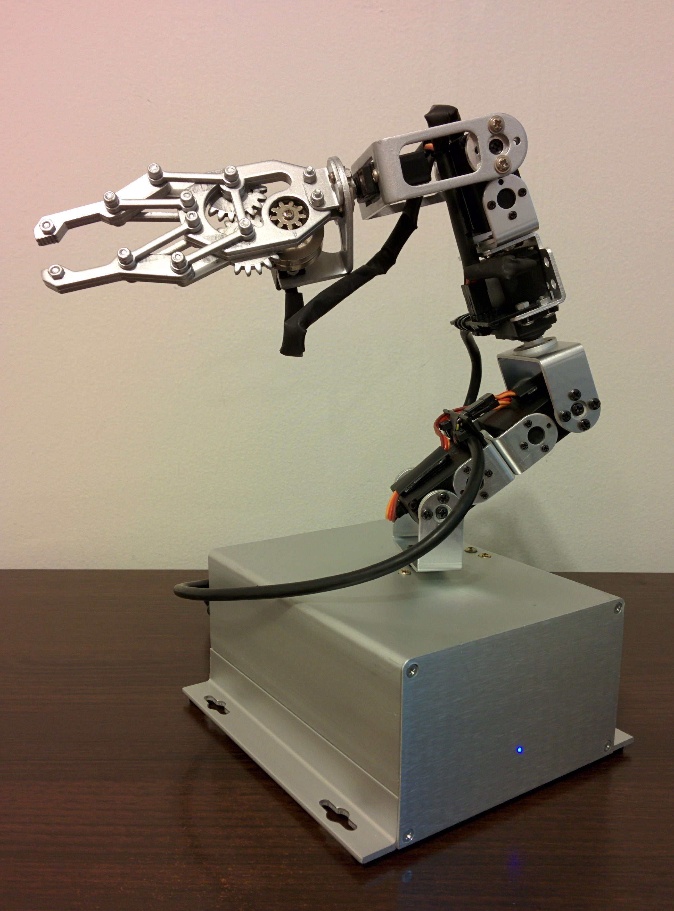

# x6 Mark I - Robotic Arm

## Introduction

## Videos
Watch this projects videos on [YouTube Playlist].

[Change log](CHANGELOG.md)

[Bill of materials](BOM.md)

[Kanban](KANBAN.md)

# Mechanics

## Case
Technical specifications:
- Material: Aluminum
- Width: 155 mm
- Height: 72 mm
- Depth: 150.4 mm

# Electronics

# Arduino
Technical specifications:
- Model: [Arduino Mega 2560]

### Pin designation table
 id | pin |   type    | direction |               description                
----|-----|-----------|-----------|--------------------------------------------
  0 |   0 | digital   | input     | Serial communication                     
  1 |   1 | digital   | output    | Serial communication                     
  2 |   2 | PWM       | output    | 1 axis signal                            
  3 |   3 | PWM       | output    | 2 axis signal                            
  4 |   4 | PWM       | output    | 3 axis signal                            
  5 |   5 | PWM       | output    | 4 axis signal                            
  6 |   6 | PWM       | output    | 5 axis signal                            
  7 |   7 | PWM       | output    | 6 axis signal                            
  8 |   8 | PWM       | output    | 7 axis signal - Clamp                    
  9 |   9 | PWM       | output    | 8 axis signal (reserved)                 
 10 |  10 | PWM       | output    | 9 axis signal (reserved)                 
 11 |  11 | PWM       | output    | Fan speed control (reserved)             
 12 |  12 | PWM       | output    | Speaker                                  
 13 |  13 | PWM       | output    | LED B (blue)                             
 14 |  14 | -         | -         | -                                        
 15 |  15 | -         | -         | -                                        
 16 |  16 | -         | -         | -                                        
 17 |  17 | -         | -         | -                                        
 18 |  18 | -         | -         | -                                        
 19 |   4 | interrupt | input     | Fan speed sensor (reserved)              
 20 |  20 | -         | -         | -                                        
 21 |  21 | -         | -         | -                                        
 22 |  22 | -         | -         | -                                        
 23 |  23 | -         | -         | -                                        
 24 |  24 | digital   | output    | LED G (green)                            
 25 |  25 | digital   | output    | LED R (red)                              
 26 |  26 | -         | -         | -                                        
 27 |  27 | -         | -         | -                                        
 28 |  28 | -         | -         | -                                        
 29 |  29 | -         | -         | -                                        
 30 |  30 | -         | -         | -                                        
 31 |  31 | -         | -         | -                                        
 32 |  32 | -         | -         | -                                        
 33 |  33 | -         | -         | -                                        
 34 |  34 | -         | -         | -                                        
 35 |  35 | -         | -         | -                                        
 36 |  36 | -         | -         | -                                        
 37 |  37 | -         | -         | -                                        
 38 |  38 | -         | -         | -                                        
 39 |  39 | -         | -         | -                                        
 40 |  40 | -         | -         | -                                        
 41 |  41 | -         | -         | -                                        
 42 |  42 | -         | -         | -                                        
 43 |  43 | digital   | input     | Power supply DC detection                
 44 |  44 | digital   | output    | Stage 2 power relay                      
 45 |  45 | digital   | output    | Stage 3 power relay                      
 46 |  46 | -         | -         | -                                        
 47 |  47 | -         | -         | -                                        
 48 |  48 | -         | -         | -                                        
 49 |  49 | -         | -         | -                                        
 50 |  50 | -         | -         | -                                        
 51 |  51 | -         | -         | -                                        
 52 |  52 | -         | -         | -                                        
 53 |  53 | -         | -         | -                                        
 54 |   0 | analog    | input     | Temperature sensor (Microcontroller)     
 55 |   1 | analog    | input     | 1 axis sensor (reserved)                 
 56 |   2 | analog    | input     | 2 axis sensor (reserved)                 
 57 |   3 | analog    | input     | 3 axis sensor (reserved)                 
 58 |   4 | analog    | input     | 4 axis sensor (reserved)                 
 59 |   5 | analog    | input     | 5 axis sensor (reserved)                 
 60 |   6 | analog    | input     | 6 axis sensor (reserved)                 
 61 |   7 | analog    | input     | 7 axis sensor (reserved)                 
 62 |   8 | analog    | input     | 8 axis sensor (reserved)                 
 63 |   9 | analog    | input     | 9 axis sensor (reserved)                 
 64 |  10 | -         | -         | -                                        
 65 |  11 | -         | -         | -                                        
 66 |  12 | -         | -         | -                                        
 67 |  13 | -         | -         | -                                        
 68 |  14 | analog    | input     | Random number generator Seed input       
 69 |  15 | analog    | input     | Temperature sensor (Power Supply)        

### Diagram

                                 +-----+
    +----[PWR]-------------------| USB |--+
    |                            +-----+  |
    |           GND/RST2  [ ] [ ]         |
    |         MOSI2/SCK2  [ ] [ ]  SCL[ ] |   D0
    |            5V/MISO2 [ ] [ ]  SDA[ ] |   D1
    |                             AREF[ ] |
    |                              GND[ ] |
    | [ ]N/C                    SCK/13[x]~|   B7
    | [ ]v.ref                 MISO/12[x]~|   B6
    | [ ]RST                   MOSI/11[x]~|   B5
    | [ ]3V3      +----------+      10[x]~|   B4
    | [ ]5v       | ARDUINO  |       9[x]~|   H6
    | [ ]GND      |   MEGA   |       8[x]~|   H5
    | [ ]GND      +----------+            |
    | [ ]Vin                         7[x]~|   H4
    |                                6[x]~|   H3
    | [x]A0                          5[x]~|   E3
    | [x]A1                          4[x]~|   G5
    | [x]A2                     INT5/3[x]~|   E5
    | [x]A3                     INT4/2[x]~|   E4
    | [x]A4                       TX>1[x]~|   E1
    | [x]A5                       RX<0[x]~|   E0
    | [x]A6                               |   
    | [x]A7                     TX3/14[ ] |   J1
    |                           RX3/15[ ] |   J0
    | [x]A8                     TX2/16[ ] |   H1         
    | [x]A9                     RX2/17[ ] |   H0
    | [ ]A10               TX1/INT3/18[ ] |   D3         
    | [ ]A11               RX1/INT2/19[x] |   D2
    | [ ]A12           I2C-SDA/INT1/20[ ] |   D1         
    | [ ]A13           I2C-SCL/INT0/21[ ] |   D0
    | [x]A14                              |            
    | [x]A15                              |   Ports:
    |                RST SCK MISO         |    22=A0  23=A1   
    |         ICSP   [ ] [ ] [ ]          |    24=A2  25=A3   
    |                [ ] [ ] [ ]          |    26=A4  27=A5   
    |                GND MOSI 5V          |    28=A6  29=A7   
    | G                                   |    30=C7  31=C6   
    | N 5 5 4 4 4 4 4 3 3 3 3 3 2 2 2 2 5 |    32=C5  33=C4   
    | D 2 0 8 6 4 2 0 8 6 4 2 0 8 6 4 2 V |    34=C3  35=C2   
    |         ~ ~                         |    36=C1  37=C0   
    | @ # # # # # # # # # # # # # # # # @ |    38=D7  39=G2    
    | @ # # # # # # # # # # # # # # # # @ |    40=G1  41=G0   
    |           ~                         |    42=L7  43=L6   
    | G 5 5 4 4 4 4 4 3 3 3 3 3 2 2 2 2 5 |    44=L5  45=L4   
    | N 3 1 9 7 5 3 1 9 7 5 3 1 9 7 5 3 V |    46=L3  47=L2   
    | D                                   |    48=L1  49=L0    SPI:
    |                                     |    50=B3  51=B2     50=MISO 51=MOSI
    |     2560                ____________/    52=B1  53=B0     52=SCK  53=SS 
    \_______________________/         

Source: http://busyducks.com/ascii-art-arduinos

### DB-25 Pins
 pin |                       description                   |  male  | female 
-----|-----------------------------------------------------|--------|----------
   1 | GND                                                 |        | white  
   2 | GND                                                 |        |        
   3 | 1 axis signal                                       | yellow |        
   4 | 2 axis signal                                       | orange | green  
   5 | 3 axis signal                                       | red    | yellow 
   6 | 4 axis signal                                       | brown  | blue   
   7 | 5 axis signal                                       | black  | gray   
   8 | 6 axis signal                                       | white  | pink   
   9 | 7 axis signal - Tool                                | gray   | brown  
  10 | 8 axis signal (reserved)                            | pink   |        
  11 | 9 axis signal (reserved)                            | blue   |        
  12 | +5 Vcc                                              |        | red    
  13 | +5 Vcc                                              |        |        
  14 | GND                                                 |        | black  
  15 | 1 axis sensor (reserved)                            |        |        
  16 | 2 axis sensor (reserved)                            |        |        
  17 | 3 axis sensor (reserved)                            |        |        
  18 | 4 axis sensor (reserved)                            |        |        
  19 | 5 axis sensor (reserved)                            |        |        
  20 | 6 axis sensor (reserved)                            |        |        
  21 | 7 axis sensor (reserved)                            |        |        
  22 | 8 axis sensor (reserved)                            |        |        
  23 | 9 axis sensor (reserved)                            |        |        
  24 | +5 Vcc                                              |        | orange 
  25 | +5 Vcc                                              |        |        

### Axes
 id | pin |                        description                               
----|-----|--------------------------------------------------------------------
  9 |  10 | Reserved                                                         
  8 |   9 | Reserved                                                         
  7 |   8 | Tool                                                             
  6 |   7 | Wrist yaw                                                        
  5 |   6 | Wirst pitch                                                      
  4 |   5 | Wrist roll                                                       
  3 |   4 | Elbow                                                            
  2 |   3 | Shoulder                                                         
  1 |   2 | Base                                                             

## Status LED
Os pinos 44, 45 e 45 do Arduino MEGA 2560 são PWM, vou realocar alguns desses pinos para o LED RGB, devo abrir o x6 para alocar a funcionalidade atual desses pinos para outros pinos.

# Software

## G-code

### G0
X (left, right)
Y (up, down)
Z (left, right)
U (up, down)
V
W
T

### G4
        * Description: Dwell
        * Parameters
          * Pnnn Time to wait, in milliseconds
          * Snnn Time to wait, in seconds
        * Example
          * G4 P300; (wait 300ms)

---
[Arduino Mega 2560]: https://store.arduino.cc/usa/arduino-mega-2560-rev3
[YouTube Playlist]: https://www.youtube.com/watch?v=jWy2m01KljI&list=PLs1JZHyVhlZVC7OqEWRuzXZp-pLl_9orX
